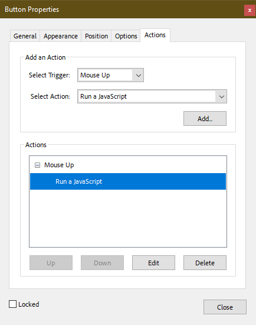

# MEST.fillable
This code drives the interactive features of `pdf/crs-forms/MEST.crs-dynamic.pdf`

1. All code is written in separate files within //src/js
2. Ensure every file has a blank-line before any non-comments otherwise they'll be joined incorrectly.
3. Be aware that JavaScript for PDF doesn't use `console.log` for debug logging but instead uses `console.println `
4. After updating `//src/js`, combine them into `//build/output.js` by using `npm run combine` from the **git-bash** terminal

## Insert Code
When creating a new interactive PDF, the code from these files must be inserted. All of the controls need to be prepared with the JavaScript code available in this repo as follows:

## Command Buttons
Each of these affect processing of information for the entire interface.
* Initialize
* Build
* Calculate
* Reset

### Initialize
1. Insert the code from `//build/output.js` as an Action for MouseUp > JavaScript
2. Insert as the last action, this invocation on mouse-up: `runInitialize();`

### Configuration Controls
Each of these display a menu and when an item is selected, populates a field. These will be used with the BUILD command `runBuild`.

Name each control button following the pattern `btn_foo_suffix` where *foo* is the name of the menu name. Name each field following the pattern `text_foo_suffix` where *foo* matches the menu control.

In both cases, the *suffix* is the information set, being `a`, `b`, or `c`. All menus are driven by a match data hash, such as VARIANTS or WEAPONS. 

As an action, insert his invocation on mouse-up for all menu controls: `displayMenuSetText(event.target.name);` .

## User-flow Sequence
The interface has this sequence for processing information:

1. Initial state; none of the controls except for the INTIALIZE button appears.
2. Clicking on the INITIALIZE button will reveal the Profile Configuration section and the BUILD and RESET buttons.
3. This will allow the end-user to choose values from the various menus.
4. As soon as the BUILD button is clicked, the CALCULATE button will appear. Clicking that will determine BP totals and burden from the **[Laden X]** trait.
5. At any time, clicking the RESET button will zero all changes made to the interace, and hide all but the INITIALIZE button.

